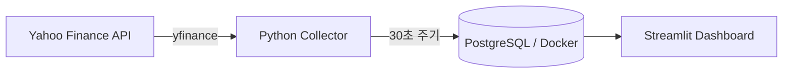
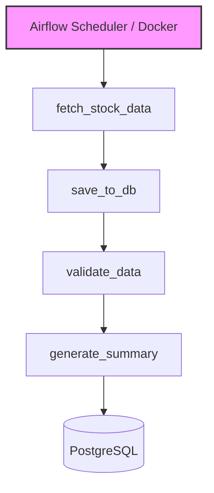
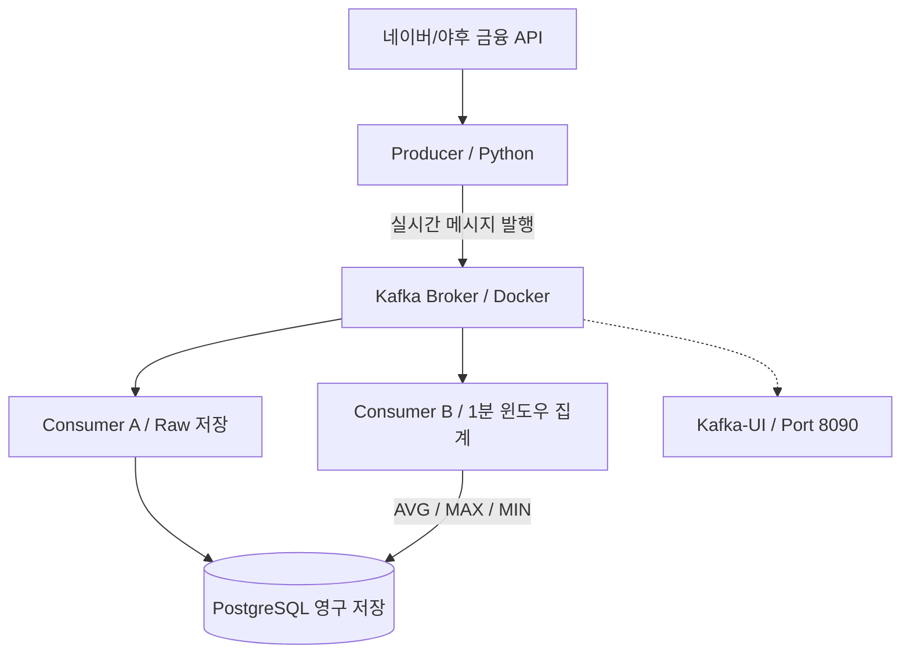

# 🚀 DE_beginner — 배치에서 실시간 스트리밍까지

데이터 엔지니어링의 핵심 패러다임 변화를 3단계 실무 프로젝트를 통해 학습합니다.

<br />

## 🗺️ 데이터 엔지니어링의 3단계 진화 로드맵


| 단계 | 저장소 폴더명 | 핵심 콘셉트 | 데이터 처리 방식 |
| :--- | :--- | :--- | :--- |
| **01** | `01_stock_pipeline` | 👤 **"내가 직접 돌린다"** | 배치 / 수동 수집 (Batch / Manual) |
| **02** | `02_airflow` | 🤖 **"스케줄러가 대신 돌린다"** | 배치 / 스케줄 자동화 (Batch / Scheduled) |
| **03** | `03_Kafka` | 🌊 **"데이터가 실시간으로 흐른다"** | 실시간 스트리밍 (Streaming / Real-time) |

---

## 🛠️ 단계별 파이프라인 상세 안내

### 📌 01. 주식 데이터 수집 파이프ライン (`01_stock_pipeline`)
> **문제 정의:** Yahoo Finance에서 삼성전자 주가를 자동으로 수집해 DB에 안정적으로 적재하려면?

#### 🏗️ 아키텍처 흐름


#### 💡 핵심 설계 결정
* **테이블 분리:** 원시 데이터(`stock_prices`)와 집계 데이터(`stock_summary`)를 분리하여 대시보드 조회 속도 확보
* **중복 방어:** `ON CONFLICT DO NOTHING` 구문을 적용해 멱등성 보장 및 데이터 중복 적재 방지
* **보안 준수:** `.env` 환경변수 파일을 활용하여 DB 접속 정보 및 민감키 분리 관리

#### 🧰 기술 스택
* `Python` · `PostgreSQL` · `Docker` · `yfinance` · `Streamlit`

---

### 📌 02. Airflow 스케줄 자동화 (`02_airflow`)
> **문제 정의:** 파이프라인을 사람이 수동으로 실행하지 않아도 매일 정해진 시간에 스스로 작동하게 하려면?

#### 🏗️ 아키텍처 흐름

* ⏱️ **실행 조건:** 평일 오전 09:00 (KST) 자동 실행
* 🔄 **예외 처리:** 태스크 실패 시 최대 3회 자동 재시도(Retry) 설정

#### 📅 DAG 목록

| DAG ID | Schedule | 목적 |
| :--- | :--- | :--- |
| `stock_pipeline_dag` | `0 9 * * 1-5` | 주가 수집 → 저장 → 검증 → 요약 파이프라인 정기 구동 |
| `hello_world_dag` | `@daily` | Airflow 환경 및 연결 상태 테스트용 |
| `failure_test_dag` | `Manual` | 태스크 실패 및 재시도 핸들링 메커니즘 검증용 |

#### 💡 핵심 학습 내용
* Task 간 데이터 공유를 위한 **XCom** 활용
* **Cron Expression**을 이용한 정밀한 스케줄링 설정
* 업스트림/다운스트림 간의 명확한 **Task 의존성(Dependency)** 설계

#### 🧰 기술 스택
* `Apache Airflow` · `Docker Compose` · `PostgreSQL`

---

### 📌 03. Kafka 실시간 스트리밍 (`03_Kafka`)
> **문제 정의:** 정기적인 배치(Batch) 단위를 넘어, 끊임없이 발생하는 주가 변동 이벤트를 실시간으로 처리하려면?

#### 🏗️ 아키텍처 흐름


#### 💡 핵심 학습 내용
* **Kafka Listeners 이해:** 내부망(`29092`)과 외부망(`9092`) 통신 포트를 분리하는 구조적 이유 습득
* **직렬화(Serialization):** `Python dict` 데이터를 가벼운 `bytes` 형태로 변환 및 역직렬화하는 파이프라인 구축
* **람다 아키텍처(Lambda Architecture):** 실시간 처리를 담당하는 Speed Layer와 배치를 담당하는 Batch Layer의 병렬 운영 이해

#### 🧰 기술 스택
* `Apache Kafka` · `Python (kafka-python)` · `Docker Compose` · `PostgreSQL`

---

## 💻 로컬 실행 환경 구축

### 1. Python 패키지 설치 (Python 3.10+ 권장)
```bash
pip install yfinance psycopg2-binary pandas streamlit python-dotenv kafka-python
```

### 2. Docker 컨테이너 구동 (Airflow / Kafka / PostgreSQL)
```bash
# 각 프로젝트 폴더 내부의 docker-compose.yml이 위치한 곳에서 실행합니다.
docker-compose up -d
```
